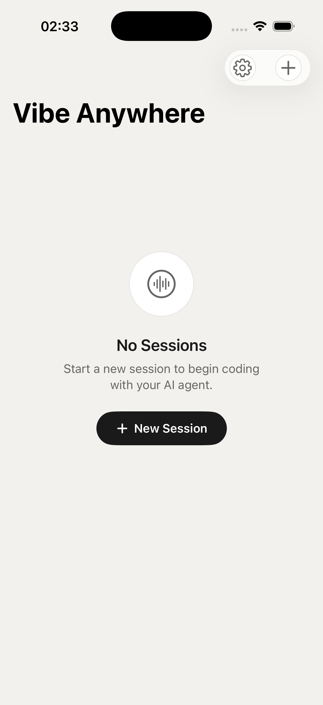
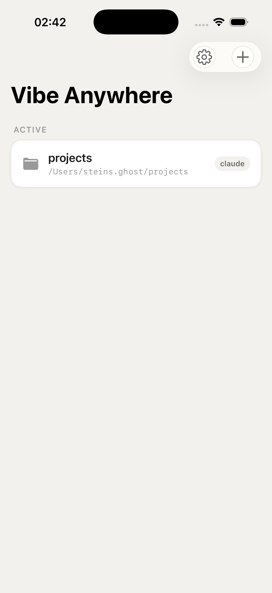
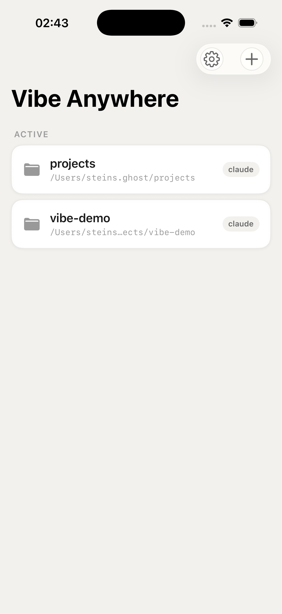

# UI Screenshots

> **Device:** iPhone 17 Pro (Simulator, iOS 26.3)  
> **App version:** latest `main` (`1b28b58`)  
> **Date:** 2026-04-14  
> **Theme:** Light (forced via `.preferredColorScheme(.light)`)

## Session List

### Empty State
Waveform icon + "No Sessions" text + "+ New Session" CTA button.  
Toolbar: gear icon (circle background) + plus icon (circle background) in a capsule.

### Single Session
Session card: folder icon, directory name (bold), full path (secondary), agent badge ("claude").  
Card uses `Theme.surface` background with continuous rounded corners.

### Multiple Sessions
Long paths get truncated with ellipsis. Cards stack vertically under "ACTIVE" section header.

## Not Yet Captured

The following screens require interactive UI navigation (tap/swipe) which couldn't be automated in headless simulator mode:

- **Settings View** — Connection config (host, port, token), theme selector, app info
- **Chat View** — Message bubbles, markdown rendering, code blocks with syntax highlighting
- **New Session Sheet** — Directory picker + agent selector
- **Disconnected State** — Error banner when daemon is unreachable

These will be added once UI testing infrastructure is set up or captured manually on a physical device.
