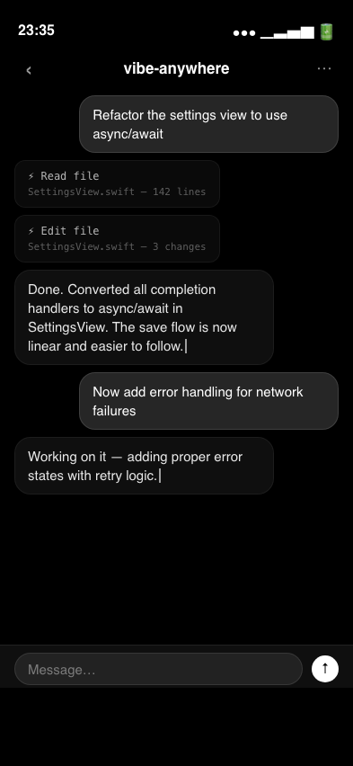
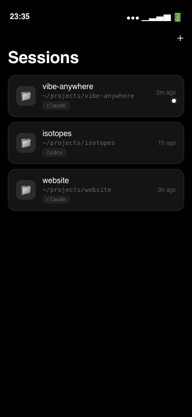
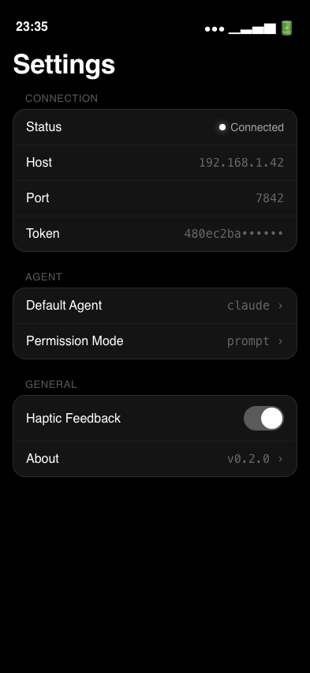

# PRD: v0.2 — UI Redesign: Black & White Minimal + Frosted Glass

**Status:** Draft (Rev 3)
**Author:** Major
**Date:** 2026-04-12
**Issue:** #52

## Direction

Black & white minimal. Frosted glass surfaces. No color accents — just light and shadow on pure black.

## Design Principles

1. **Monochrome** — white text on black, glass cards for depth
2. **Frosted glass** — `.ultraThinMaterial` / `.regularMaterial` for all cards, tab bar, input bar
3. **iOS native** — system fonts, standard layouts, large titles
4. **Minimal** — no decorative elements, no custom icons, let the content breathe

## Color Palette

| Token | Value | Usage |
|-------|-------|-------|
| `background` | `#000000` | App background |
| `surface` | `rgba(255,255,255,0.08)` + blur | Glass cards |
| `border` | `rgba(255,255,255,0.10)` | Card borders |
| `textPrimary` | `#FFFFFF` | Body text |
| `textSecondary` | `rgba(255,255,255,0.35)` | Paths, timestamps, captions |
| `textMuted` | `rgba(255,255,255,0.20)` | Placeholder, disabled |

## Components

### Tab Bar
- Frosted glass background
- White selected, 40% white unselected
- System SF Symbol icons

### Chat View
- **User bubbles**: brighter glass (`rgba(255,255,255,0.15)`) + subtle border, right-aligned
- **Assistant bubbles**: dim glass (`rgba(255,255,255,0.06)`), left-aligned
- **Tool cards**: minimal glass, monospace tool name, collapsed by default
- **Input bar**: frosted glass, rounded text field, white send circle with ↑
- **Streaming**: thin blinking cursor `|`

### Session List
- Large title "Sessions"
- Glass card per session
- Folder icon, project name (system weight 500), monospace path
- Agent badge (monospace, dim glass pill)
- Active dot: white with soft glow
- `+` button top-right

### Settings
- Large title "Settings"
- Grouped glass sections: Connection, Agent, General
- Uppercase section headers at 35% white
- Monospace values right-aligned
- Status dot: white + glow = connected
- System toggle for switches

## Mockups

| Chat | Sessions | Settings |
|------|----------|----------|
|  |  |  |

HTML mockup source in `docs/prd/mockups/*.html`.

## Implementation

| File | Change |
|------|--------|
| NEW `Theme.swift` | Color tokens, glass modifiers |
| `VibeAnywhereApp.swift` | `.preferredColorScheme(.dark)`, tab tint white |
| `ChatView.swift` | Glass input bar, monochrome bubbles |
| `MessageBubble.swift` | Glass bubbles, tool cards |
| `SessionListView.swift` | Glass rows, active dot |
| `SettingsView.swift` | Glass grouped sections |
| `NewSessionView.swift` | Glass form |

~300-400 LOC. Purely cosmetic — no logic changes.

## Not in Scope
- Light mode
- Custom icons or illustrations
- App icon redesign
