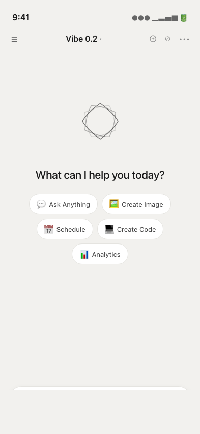
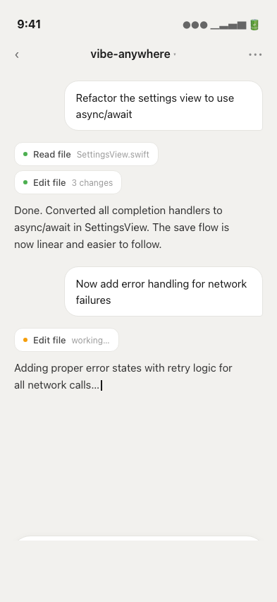
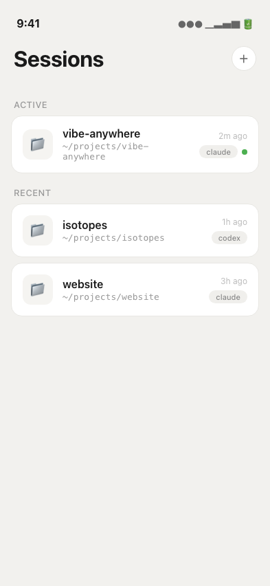
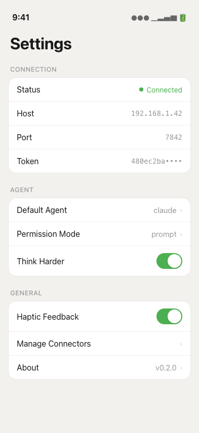

# PRD: v0.2 — UI Redesign: Light Minimal (Xora-inspired)

**Status:** Draft (Rev 4)
**Author:** Major
**Date:** 2026-04-12
**Issue:** #52

## Direction

Light, warm, clean. Xora-inspired AI chat aesthetic. Large logo empty state, quick action chips, soft card surfaces on warm gray background.

## Design Principles

1. **Warm neutral** — off-white/warm gray background, white card surfaces
2. **Clean hierarchy** — large titles, clear sections, generous whitespace
3. **Soft depth** — subtle borders + shadows, no heavy effects
4. **iOS native** — system fonts, standard patterns, familiar gestures

## Color Palette

| Token | Value | Usage |
|-------|-------|-------|
| `background` | `#F2F1EE` | App background (warm gray) |
| `surface` | `#FFFFFF` | Cards, input bar, chips |
| `border` | `#E8E7E3` | Card borders |
| `borderLight` | `#F0EFEC` | Row separators |
| `textPrimary` | `#1A1A1A` | Headings, body |
| `textSecondary` | `#666666` | Labels, nav icons |
| `textTertiary` | `#999999` | Paths, timestamps, placeholders |
| `accent` | `#4CAF50` | Active dot, status connected, toggles |
| `accentWarm` | `#F59E0B` | In-progress indicators |
| `buttonDark` | `#1A1A1A` | Send/mic button background |

## Screens

### 1. Chat — Empty State
- Centered logo (geometric SVG, light strokes)
- "What can I help you today?"
- Quick action chips: Ask Anything, Create Image, Schedule, Create Code, Analytics
- Bottom input bar: rounded white pill, `+` button, mic button (dark circle)

### 2. Chat — Active Conversation
- User messages: white card, right-aligned, rounded corners (top-right sharp for tail)
- Assistant messages: no background, left-aligned, plain text
- Tool cards: compact white pill with status dot (green=done, amber=working), tool name, detail
- Streaming: thin blinking cursor `|`
- Nav: back arrow, session name + chevron, `•••` menu

### 3. Sessions List
- Large title "Sessions"
- `+` button (white circle, bordered)
- Section labels: "ACTIVE" / "RECENT" (uppercase, gray)
- Session cards: white, bordered, rounded 16px
  - Folder icon, project name (bold), monospace path
  - Agent badge (gray pill), green dot for active
  - Timestamp top-right

### 4. Settings
- Large title "Settings"
- Grouped white card sections: Connection, Agent, General
- Uppercase gray section headers
- Standard iOS rows: label left, value/chevron right
- Green toggles (Think Harder, Haptic Feedback)
- "Manage Connectors" row (from Xora reference)

## Mockups

| Empty State | Chat Active | Sessions | Settings |
|-------------|-------------|----------|----------|
|  |  |  |  |

HTML mockup source in `docs/prd/mockups/*.html`.

## Implementation

| File | Change |
|------|--------|
| NEW `Theme.swift` | Color tokens, typography, spacing constants |
| `VibeAnywhereApp.swift` | Background color, tab structure |
| NEW `EmptyStateView.swift` | Logo + welcome + chips |
| `ChatView.swift` | Warm background, white input bar |
| `MessageBubble.swift` | White user bubbles, plain assistant text, tool cards |
| `SessionListView.swift` | White cards, section headers, active dot |
| `SettingsView.swift` | White grouped sections, green toggles |
| `NewSessionView.swift` | White card form |

~400-500 LOC. Purely cosmetic — no logic changes.

## Not in Scope
- Dark mode (future follow-up)
- Voice mode (3D sphere animation — separate issue)
- Custom app icon
- Connector management UI (settings row only, no implementation)
