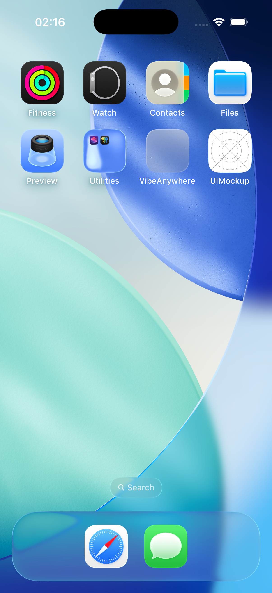
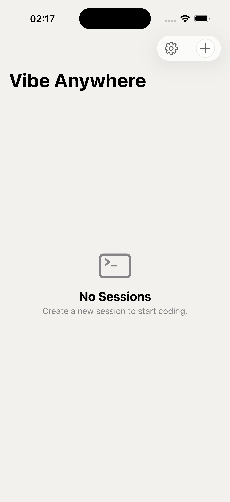

# Vibe Anywhere — UI Screenshots (v0.2)

Design: Light minimal, Xora-inspired (`#F2F1EE` warm gray background, white cards)

## Screens

### 1. Not Connected

- Warm gray `#F2F1EE` background
- `ContentUnavailableView` with wifi.slash icon
- Settings gear (gearshape) in top-right with `Theme.textSecondary` tint

### 2. Session List (Empty)

- Connected state — `+` button appears (white circle with border)
- Settings gear + New Session button in toolbar
- `ContentUnavailableView` with terminal icon

### 3. Session List (With Sessions) — *not captured*
- White card per session with `CardStyle` modifier (border + shadow)
- Folder icon + directory name (headline) + path (monospaced caption)
- Agent badge (capsule, `Theme.background` fill)
- "ACTIVE" section header (caption, bold, tracking 1)
- Context menu with Delete option

### 4. Chat — Empty State — *not captured*
- `EmptyStateView` with logo (waveform.circle in white circle)
- "What can I help you today?" subtitle
- Quick action chips in `FlowLayout` (capsules with icons)
- Input bar at bottom (white surface background)

### 5. Chat — With Messages — *not captured*
- User messages: white bordered cards (`Theme.radiusMd`)
- Assistant messages: plain text, no background
- Tool uses: capsule pills with status dot (green/amber/red)
- Streaming: 3 dots indicator
- Usage bar: gauge icon + token counts (tertiary color)
- Input: dark circle send button, red circle stop button

### 6. Settings — *not captured*
- Form with uppercase section headers (CONNECTION, AUTHENTICATION, STATUS)
- Status dot: green (`Theme.accent`) for connected, amber (`Theme.accentWarm`) for connecting
- Eye toggle for token visibility

---

*Captured on iPhone 17 Pro simulator (iOS 26.3.1), Xcode 26*
*Screens 3-6 require interactive UI automation — will be added in a follow-up*
